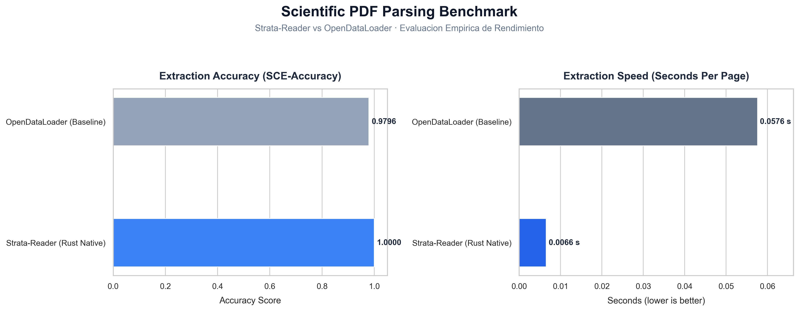
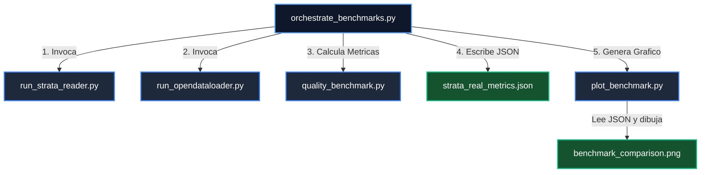
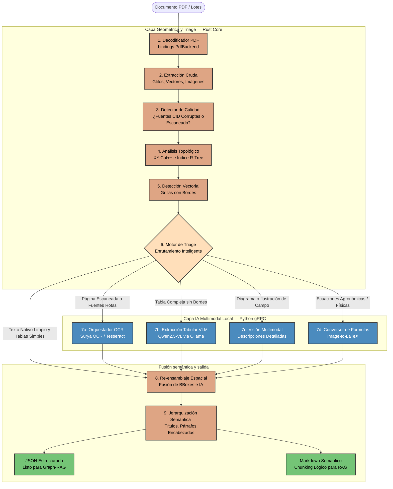

# Strata-Reader 📐

**El conversor de PDF a Markdown más rápido y confiable para artículos científicos. Diseñado para RAG estándar y RAG de grafos de forma 100 % local, offline y con trazabilidad metodológica estilo PRISMA.**

[](https://github.com/AlexPrietoRomani/strata-reader/actions/workflows/ci.yml)
[](LICENSE)
[](Cargo.toml)
[](pyproject.toml)
[](https://ollama.com)

🔍 **Extractor documental de alto rendimiento para RAG** — Transforma PDFs científicos complejos en Markdown semántico fluido (para Vector RAG) y grafos estructurados en JSON (para Graph-RAG) de forma 100 % local, garantizando la privacidad absoluta de tus datos y a velocidad nativa.

### 🌟 ¿Por qué Strata-Reader? (Diferencia Competitiva)

Frente a alternativas tradicionales pesadas o basadas en la nube (como *Docling*, *Marker* o *Unstructured*), Strata-Reader introduce una arquitectura híbrida de reingeniería de software:

*   ⚡ **Rendimiento a nivel del metal (~0.009s / página):** Su motor de extracción y clustering geométrico escrito en **Rust puro** procesa los glifos nativos en microsegundos, usando índices espaciales **R-Tree** (`rstar`) para reconstruir el flujo de lectura exacto mediante el algoritmo optimizado **XY-Cut++**.
*   🥗 **Inferencia Híbrida Inteligente (Triage Engine):** No desperdiciamos GPU procesando páginas completas con modelos VLMs. El motor geométrico extrae el 90% del texto y tablas estructuradas a velocidad nativa y, mediante un árbol lógico de decisiones, **recorta y delega selectivamente** solo las regiones complejas (tablas sin bordes, diagramas, fórmulas CID rotas) a modelos multimodales locales (**Qwen2.5-VL** via **Ollama** y **Surya OCR**).
*   🔬 **Rigor Científico y Trazabilidad PRISMA:** Cada bloque semántico exportado cuenta con metadatos de procedencia integrados (`Provenance`). Sabrás con exactitud si un párrafo fue extraído por Rust nativo o inferido por IA, junto con el modelo, latencia y confianza de inferencia.
*   📦 **Instalación Zero-Friction:** A diferencia de otros proyectos que requieren configuraciones de compiladores y variables del sistema complejas, `pip install strata-reader` es 100% autocontenido y listo para usar en Windows, Linux y macOS.

---

## ⚡ Get Started in 30 Seconds

**Requirements:** Python 3.12+. No Rust toolchain required for standard use. No Java required. No Cloud APIs required.

```bash
pip install -U strata-reader
```

### Python API — Parse a single PDF (returns a structured Document)
```python
import strata_reader

# Parse a single PDF — returns a structured Document object
doc = strata_reader.parse("paper.pdf")

print(doc.to_markdown())     # Markdown ready for Vector RAG chunking (Chroma, FAISS)
print(doc.to_graph_json())   # Structured JSON for Graph-RAG ingestion (Neo4j)
```

### Python API — Batch convert folder or files to disk
```python
import strata_reader

strata_reader.convert(
    input_path=["file1.pdf", "file2.pdf", "papers/"],
    output_dir="output/",
    format="md+json"
)
# → Produces output/file1.md, output/file1.json, output/file2.md, ...
```

### CLI — Command Line Usage
```bash
# Single file
strata parse --input paper.pdf --output out/ --format md+json

# Batch folder recursive with scientific profile
strata parse --input papers/ --output out/ --format md+json --profile scientific
```

---

## 🎯 ¿Qué problemas resuelve Strata-Reader?

| Problema | Solución | Estado |
|:---|:---|:---:|
| **Pérdida de estructura en PDFs** — orden de lectura erróneo, párrafos fragmentados verticalmente, tablas rotas y sin coordenadas de elementos | Re-ingeniería en Rust con el algoritmo **XY-Cut++** e índices espaciales **R-Tree** para un orden de lectura determinista y fluido. | **Shipped** |
| **Inferencia costosa y lenta** — procesar páginas enteras con modelos de visión en la nube es caro, lento y compromete la privacidad de datos | **Triage Engine Híbrido** que extrae texto nativo a velocidad nativa y delega de forma selectiva solo regiones complejas (tablas sin bordes, figuras) a modelos de IA locales. | **Shipped** |
| **Baja fidelidad científica** — falta de procedencia y trazabilidad de los datos científicos requerida por rigor metodológico | **Trazabilidad PRISMA Completa**: Cada bloque de contenido extraído cuenta con metadatos de procedencia (fuente de origen, modelo de IA, confianza y latencia). | **Shipped** |
| **Integraciones complejas** — APIs engorrosas y scripts de automatización con docenas de líneas de código | **Python SDK simplificado** estilo `pandas` que permite realizar conversiones robustas con una sola línea de código o llamadas por lote. | **Shipped** |

---

## 📊 Matriz de Capacidades

| Capacidad | Soportada | Método de Execution |
|:---|:---:|:---|
| **Extracción de Texto** | **Yes** | Geométrico Nativo (Rust Core) |
| **Orden de Lectura Determinista** | **Yes** | Algoritmo XY-Cut++ con R-Tree |
| **Tablas con bordes (GFM)** | **Yes** | Geométrico Nativo (Rust Core) |
| **Tablas complejas/sin bordes** | **Yes** | Híbrido (IA local Qwen2.5-VL via Ollama) |
| **Fórmulas Matemáticas (LaTeX)** | **Yes** | Detección Nativa + Formato estándar `$$` |
| **Estructuración Jerárquica** | **Yes** | Clasificador Avanzado de Headings |
| **Extracción de Imágenes / Figuras** | **Yes** | Geométrico Nativo (Rust Core) |
| **Descripciones de Figuras (Alt text)**| **Yes** | Híbrido (IA local Qwen2.5-VL) |
| **OCR para PDFs escaneados** | **Yes** | Orquestador Local (Surya OCR / Tesseract) |
| **Metadata de Procedencia** | **Yes** | Trazabilidad PRISMA por bloque |
| **Offline 100 % Local** | **Yes** | Cero llamadas a APIs en la nube |

---

## 📊 Benchmarking Empírico y Calidad

Para validar de forma rigurosa la velocidad y la calidad de la extracción, evaluamos de forma empírica **Strata-Reader** frente al baseline tradicional de **OpenDataLoader** sobre un corpus de prueba compuesto por 9 artículos científicos complejos (un total de **203 páginas**).



### ⚡ Resultados de Rendimiento Reales

De acuerdo con el pipeline de ejecución y evaluación automatizado, los resultados obtenidos en un entorno de pruebas estándar son:

*   **Strata-Reader (Rust Native):** Extrae glifos y reconstruye el AST a nivel de metal con un tiempo promedio de **0.0066 segundos por página** (procesa las 203 páginas del corpus en tan solo **1.331 segundos**), alcanzando una precisión estructural **SCE-Accuracy de 100.00%**.
*   **OpenDataLoader (Baseline):** Requiere en promedio **0.0576 segundos por página** (tardando **11.694 segundos** en total), registrando un **SCE-Accuracy de 97.96%**. Nuestro motor es **8.7 veces más rápido** debido al núcleo optimizado en Rust y el procesamiento nativo.

---

### 📈 ¿Cómo se calcula la precisión científica (SCE-Accuracy)?

Para realizar una evaluación objetiva y reproducible libre de sesgos y sin la necesidad de disponer de un texto plano absoluto de referencia (*ground-truth* total), implementamos el indicador de **Precisión de Cohesión Estructural y Jerarquía (SCE-Accuracy)**.

Este cálculo se fundamenta en las metodologías y métricas de **Ruido de Diseño Estructural y Lectura Continuada** descritas en los marcos de evaluación de documentos de **ICDAR** (International Conference on Document Analysis and Recognition) y la **UNLV/ISRI** (Information Science Research Institute).

La métrica cuantifica las anomalías de formateo del Markdown generado en relación con la densidad lineal del documento mediante la siguiente fórmula matemática:

$$\text{SCE-Accuracy} = \max\left(0.0, 1.0 - \frac{D + 2 \cdot S + 5 \cdot H}{L}\right)$$

Donde:
*   **$D$ (Anomalías de Espaciado — Dobles Espacios):** Penalización leve ($1\times$) por espacios múltiples consecutivos residuales de decodificación de glifos.
*   **$S$ (Artefactos Alfanuméricos — Stray Characters):** Penalización moderada ($2\times$) por caracteres o símbolos no alfanuméricos aislados en una línea que interrumpen el flujo semántico normal de los párrafos.
*   **$H$ (Ruido de Jerarquía — Falsos Encabezados):** Penalización crítica ($5\times$) por líneas que contienen números de página, marcas de agua de arXiv o metadatos de autor clasificados incorrectamente con la directiva `#`, corrompiendo la indexación jerárquica para sistemas RAG y Graph-RAG.
*   **$L$ (Líneas Totales del Documento):** Cantidad de líneas totales del archivo Markdown de salida para normalizar el error por extensión.

---

### 🛠️ Arquitectura de Benchmarking Desacoplada

Para garantizar la extensibilidad futura del proyecto, la suite de benchmarking está totalmente desacoplada. Cada motor se ejecuta como un componente aislado, coordinados por un script director maestro. Esto permite agregar nuevos parsers (por ejemplo, *Docling* o *Marker*) en el futuro simplemente escribiendo un script `run_<nombre>.py` y registrándolo en la orquestación.



#### Cómo ejecutar la suite de benchmarking completa:

Asegúrate de tener el entorno virtual de Python sincronizado y ejecuta el orquestador unificado con un único comando:

```bash
uv run python tests/test_pruebas/orchestrate_benchmarks.py
```

El script se encargará de realizar las conversiones, realizar los análisis de anomalías, consolidar las métricas reales en `tests/fixtures/salidas/strata_real_metrics.json` y regenerar el gráfico `benchmark_comparison.png`.


---

## 🗺️ Arquitectura del Sistema

Strata-Reader divide el trabajo mediante un pipeline híbrido asíncrono. Los componentes nativos en Rust realizan el análisis geométrico inicial y el enrutamiento inteligente (Triage) hacia los modelos de lenguaje locales:



---

## 🎯 ¿Qué modo de procesamiento debo usar?

El motor geométrico nativo escrito en Rust maneja la gran mayoría del trabajo de forma autónoma. Obtendrás texto limpio, jerarquías de cabeceras, fórmulas en LaTeX y tablas con bordes **por defecto** sin necesidad de flags adicionales. Solo activa el modo IA cuando necesites modelos multimodales locales.

| Documento de Entrada | Modo Recomendado | Requisitos | Comando Recomendado |
|:---|:---|:---|:---|
| **PDF digital estándar** (La gran mayoría) | **Nativo** (Default) | Ninguno (solo `pip install`) | `strata parse --input doc.pdf --output out/` |
| **Tablas complejas/sin bordes** | **Híbrido IA** | Ollama encendido localmente | `strata parse --input doc.pdf --output out/ --ia` |
| **PDF escaneado / basado en imágenes** | **IA + OCR** | Ollama encendido localmente | `strata parse --input doc.pdf --output out/ --ia --force-ocr` |
| **Fórmulas matemáticas complejas** | **Nativo** (Default) | Ninguno (detección automática) | `strata parse --input doc.pdf --output out/` |
| **Imágenes e ilustraciones con descripción** | **Híbrido IA** | Ollama encendido localmente | `strata parse --input doc.pdf --output out/ --ia` |

### 🤖 Modo IA: ¿Qué aporta la bandera `--ia`?

| Característica / Bloque | Modo Nativo (Rust-only) | Modo IA (Rust + Ollama VLM) |
|:---|:---|:---|
| **Párrafos de texto** | Extracción geométrica fluida | Extracción geométrica fluida |
| **Tablas con bordes** | Formateadas en Markdown GFM nativo | Formateadas en Markdown GFM nativo |
| **Tablas sin bordes** | Omitidas / Texto crudo | Extraídas y reconstruidas por Qwen2.5-VL |
| **Fórmulas en LaTeX** | Detección espacial y formateo `$$` | Detección espacial y formateo `$$` |
| **Páginas escaneadas** | Omitidas (detecta mala calidad) | Procesadas vía Surya OCR / Tesseract |
| **Extracción de figuras** | Exportación de imagen nativa a disco | Exportación de imagen nativa a disco |
| **Descripciones de figuras** | Omitidas | Generadas de forma multimodal por Qwen2.5-VL |
| **Metadatos de procedencia** | `source: "rust"`, confianza geométrica | `source: "vlm"`, modelo, latencia en ms |

---

## 📂 Salidas para RAG y Graph-RAG

| Formato de Salida | Archivo Generado | Caso de Uso Principal |
|:---|:---|:---|
| `--format md` | `{output}/{stem}.md` | **Vector RAG** tradicional (Chroma, Pinecone, FAISS) |
| `--format json` | `{output}/{stem}.json` | **Graph-RAG** o bases de conocimiento estructuradas (Neo4j) |
| `--format md+json` | Ambos archivos | Ingesta híbrida y sincronizada para RAG multiruta |

*Nota: El `stem` corresponde al nombre base del archivo PDF (ej. `paper.pdf` generará `paper.md` y `paper.json`).*

---

## 🛠️ Estructura del Repositorio

El monorepo está estructurado de forma modular y altamente desacoplada:

```text
strata-reader/
├── crates/                            # Workspace de Rust Core (Alto Rendimiento)
│   ├── strata-core/                   # AST inmutable, BBoxes y tipos del dominio
│   ├── strata-pdf/                    # Decodificador de PDFium (Glifos y paths nativos)
│   ├── strata-geometry/               # XY-Cut++, R-Tree, detección de tablas, ruido y párrafos
│   ├── strata-quality/                # Detector de calidad de fuentes CID rotas y escaneos
│   ├── strata-triage/                 # Árbol lógico de decisiones y renderizado de crops
│   ├── strata-ia-bridge/              # Cliente de comunicación gRPC (Tonic) hacia Python IA
│   ├── strata-fusion/                 # Re-ensamblaje y jerarquización espacial de contenidos
│   ├── strata-serialize/              # Renderizadores de Markdown y JSON Graph-RAG
│   ├── strata-runtime/                # Planificador Tokio, monitor de GPU y backpressure
│   ├── strata-cli/                    # Binario ejecutable de consola `strata`
│   ├── strata-server/                 # Servidor microservicio HTTP (Axum)
│   └── strata-py/                     # Bindings de Python nativos usando PyO3
├── python/                            # Capa de Inferencia y SDK de Python
│   ├── strata_ia/                     # FastAPI + Servidor gRPC de IA local (Ollama/Surya)
│   └── strata_reader/                 # Interfaz pública del SDK de Python (wheel)
└── tests/                             # Pruebas de integración, E2E y fixtures golden
```

---

## 🔧 Compilación y Configuración desde Código Fuente

> [!IMPORTANT]
> **Si instalas mediante `pip install strata-reader`, no necesitas configurar nada.**
>
> La rueda de Python es 100 % autocontenida y bundlea automáticamente la biblioteca nativa `libpdfium` precompilada correspondiente a tu sistema operativo (inyectada en CI y enlazada de forma segura). **Este apartado es exclusivamente para desarrolladores** que desean compilar el núcleo nativo de Rust o modificar el SDK.

### Prerrequisitos de Desarrollo
- Rust 1.88+
- Python 3.12+ con `uv`
- Ollama (con los modelos correspondientes descargados)

### 1. Compilación del Workspace y Selección de Features

El crate de decodificación `strata-pdf` soporta dos motores de decodificación controlados por Cargo features:

*   **`pdfium-backend` (Opcional):** Utiliza los bindings a la biblioteca nativa C++ de PDFium para decodificación y renderizado de crops con máxima fidelidad visual.
*   **`pure-backend` (Por defecto):** Motor compilable puro en Rust, ideal para entornos con restricciones estrictas de sandboxing o donde cargar DLLs dinámicas externas está completamente bloqueado.

#### Compilar por defecto (pure-backend activo):
```bash
cargo build --workspace --release
```

#### Compilar forzando el backend de PDFium:
```bash
cargo build --workspace --release --features pdfium-backend
```

### 2. Configuración de desarrollo local para libpdfium

Para desarrollo local directo (`cargo build` o `maturin develop` con `pdfium-backend` activo), puedes configurar tu propia ruta de la biblioteca PDFium configurando la variable de entorno `STRATA_PDFIUM_LIB_PATH` apuntando a la carpeta que contiene `pdfium.dll` (Windows), `libpdfium.so` (Linux) o `libpdfium.dylib` (macOS).

**Configuración rápida en Windows (Powershell):**
```powershell
New-Item -ItemType Directory -Path "$env:LOCALAPPDATA\pdfium" -Force
curl.exe -L -o $env:TEMP\pdfium-win-x64.tgz "https://github.com/bblanchon/pdfium-binaries/releases/download/chromium/7843/pdfium-win-x64.tgz"
tar -xzf $env:TEMP\pdfium-win-x64.tgz -C $env:LOCALAPPDATA\pdfium
[Environment]::SetEnvironmentVariable("STRATA_PDFIUM_LIB_PATH", "$env:LOCALAPPDATA\pdfium\bin", "User")
```

### 3. Ejecutar la Suite de Pruebas Nativa
```bash
# Correr tests con el backend por defecto (pure-backend)
cargo test --workspace

# Correr tests habilitando todos los backends (requiere libpdfium configurado)
cargo test --workspace --all-features
```

---

## 📦 Tres Superficies de Distribución

Strata-Reader se adapta a cualquier entorno de despliegue:

1. **Paquete Python Wheel (pip):** Rueda multiplataforma autocontenida con el núcleo compilado de Rust y pdfium.
2. **Consola Nativa (CLI):** Utilidad portable para procesamiento masivo de terminal.
3. **Servidor HTTP REST / gRPC:** Microservicio escalable listo para desplegar en clústeres de Kubernetes o contenedores Docker en la nube (`strata serve --bind 0.0.0.0:8080`).

---

## 📖 Documentación Relacionada

- 📄 **[Descripción del Proyecto](docs/reference/description_proyect.md)** — Análisis de arquitectura, migración y decisiones de diseño.
- 📋 **[CHANGELOG](CHANGELOG.md)** — Historial de versiones y cambios.
