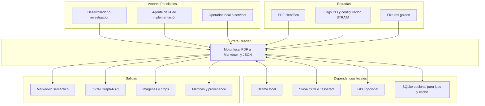
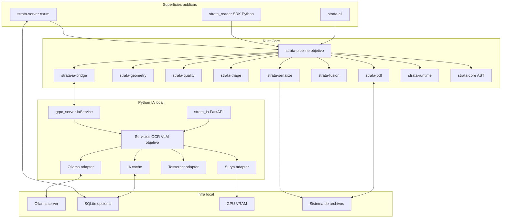
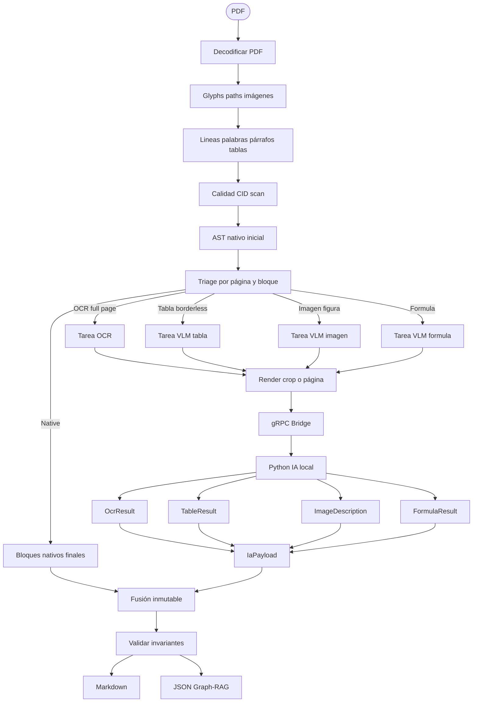
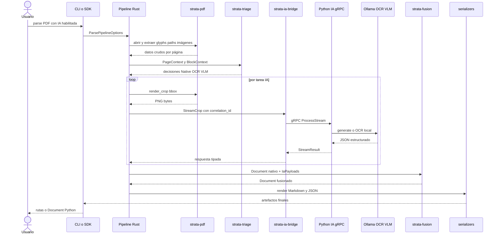
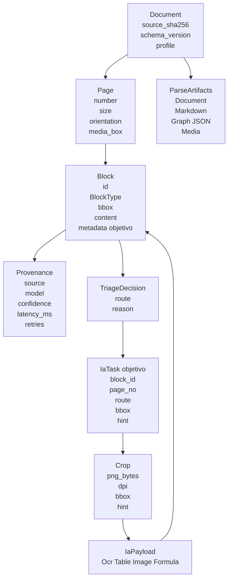
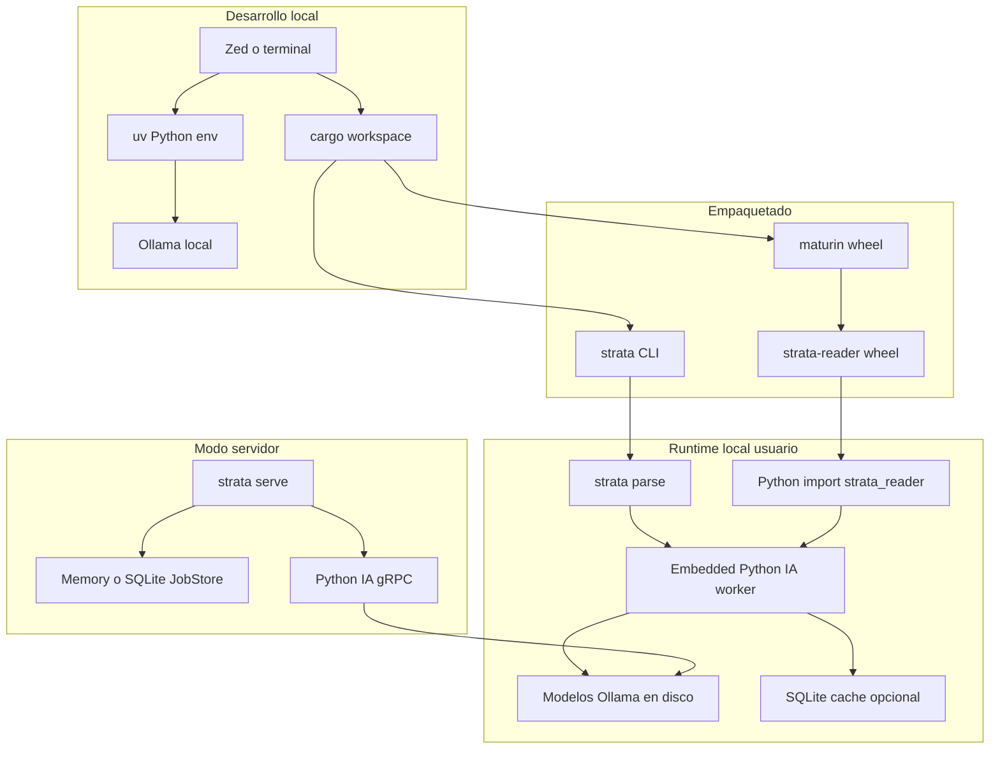

# Arquitectura — Strata-Reader

> **Audiencia:** Arquitectos de solución, líderes técnicos, desarrolladores y agentes de IA que implementen o revisen el pipeline PDF → Markdown/JSON.
> **Alcance:** Describe la estructura fundamental del sistema, sus contenedores internos, el proceso crítico de extracción documental, el modelo de dominio y el despliegue local/offline. Para tareas ejecutables ver [`docs/task/tareas.md`](../task/tareas.md); para planificación de fases ver [`docs/plan/plan_maestro.md`](../plan/plan_maestro.md).
>
> **Estado de referencia:** Este documento refleja la arquitectura objetivo posterior a la Fase 14. La auditoría previa detectó que varios componentes IA ya existen, pero todavía deben conectarse end-to-end en el pipeline real.

---

## 1. Visión General del Sistema (C4 – Nivel Contexto)

Strata-Reader convierte PDFs científicos en Markdown semántico y JSON estructurado para RAG/Graph-RAG. El sistema opera 100 % local: usa Rust para decodificación, geometría y serialización; usa Python IA local para OCR y VLM mediante Ollama, Surya y Tesseract. No hay llamadas cloud en código productivo.

**Decisiones arquitectónicas clave:**

- **On-premise/offline:** IA local mediante Ollama, Surya y Tesseract; prohibidas APIs cloud en producción.
- **Rust core primero:** extracción nativa, geometría, Triage, fusión y serialización viven en crates Rust para rendimiento y determinismo.
- **Python IA aislada:** modelos pesados y adaptadores multimodales viven en `python/strata_ia` para aprovechar ecosistema Python.
- **Contrato explícito:** Rust y Python se comunican por gRPC (`strata.ia.v1`) con payloads tipados.
- **Fusión inmutable:** la IA no muta el AST original; produce payloads que se fusionan en un nuevo `Document`.
- **Distribución dual:** CLI/servidor Rust y SDK Python con PyO3/maturin.

---

## 2. Componentes Internos (C4 – Nivel Contenedor)

**Flujo de una interacción típica:**

1. El usuario ejecuta `strata parse --input paper.pdf --format md+json --ia` o llama `strata_reader.parse(..., use_ia=True)`.
2. La superficie pública construye `ParsePipelineOptions` y delega al orquestador común.
3. El pipeline abre el PDF, extrae glyphs, paths e imágenes y construye bloques nativos iniciales.
4. Triage decide qué bloques se quedan nativos y cuáles escalan a OCR/VLM.
5. El pipeline renderiza crops y los envía por gRPC al microservicio Python IA.
6. Python IA ejecuta OCR o VLM local y devuelve respuestas tipadas con provenance.
7. Rust convierte respuestas a `IaPayload`, fusiona el AST y serializa Markdown/JSON.
8. CLI/SDK/servidor entregan artefactos al usuario y exponen métricas/logs.

---

## 3. Lógica Core / Procesos Críticos

### 3.1 Pipeline PDF → Markdown/JSON objetivo

### 3.2 Rutas de Triage

| Ruta | Trigger principal | Backend | Bloque final esperado |
| --- | --- | --- | --- |
| `Native` | Texto limpio, tabla simple, figura sin IA | Rust | `Paragraph`, `Heading`, `Table`, `Figure` básico |
| `OcrFullPage` | Página escaneada, CID crítico, `--force-ocr` | Surya → Tesseract → Ollama fallback | `Paragraph`/bloques OCR con `source=ocr` |
| `VlmTable` | Tabla sin bordes o perfil científico agresivo | Ollama VLM | `Table` con Markdown GFM |
| `VlmImage` | Imagen/diagrama relevante | Ollama VLM | `Figure` con caption, alt text y descripción |
| `VlmFormula` | Fórmula con baja confianza nativa | Ollama VLM o backend formula | `Equation` con LaTeX |

### 3.3 Invariantes del pipeline

- Mismo PDF + mismas opciones + mismas versiones de modelos deben producir salida estable, salvo timestamps explícitamente excluidos.
- Cada bloque con contenido IA debe tener `ProvenanceSource::Ocr` o `ProvenanceSource::Vlm`.
- Ninguna llamada IA debe ocurrir si `use_ia=false` o `--no-ia` está activo.
- `--force-ocr` debe ser visible en provenance o metadata para auditoría.
- Las respuestas IA inválidas no se fusionan silenciosamente; producen error tipado o fallback documentado.
- El pipeline no debe duplicar bloques por regiones superpuestas sin política de reconciliación.

---

## 4. Flujo de Secuencia (Uso IA completo)

---

## 5. Modelo de Dominio / Entidades Clave

**Políticas de datos:**

- `Document`, `Page` y `Block` se tratan como AST inmutable; los cambios crean nuevos nodos/árboles.
- `BBox` se normaliza y redondea a 4 decimales para estabilidad.
- `BlockId` debe permanecer estable dentro de una corrida y correlacionarse con resultados IA.
- Metadata multimodal debe serializarse con claves estables y compatibles con Graph-RAG.
- Caché IA se indexa por hash de crop, modelo, prompt y tipo de tarea.
- Contenido sensible del PDF no debe aparecer en logs por defecto.

---

## 6. Arquitectura de Despliegue

**Modos soportados:**

| Modo | Entrada | Requisitos | Salida |
| --- | --- | --- | --- |
| CLI nativo | `strata parse --no-ia` | Binario Rust | Markdown/JSON sin OCR/VLM |
| CLI IA | `strata parse --ia` | Ollama local y Python IA | Markdown/JSON enriquecido |
| SDK Python | `strata_reader.parse()` | Wheel instalada | `Document` Python con serializers |
| Servidor HTTP | `strata serve` + `/v1/parse` | JobStore y worker IA opcional | Jobs con artefactos |
| Tests CI mock | `cargo nextest` | gRPC fake | Validación sin modelos |
| Tests IA reales | `pytest -m ollama` | Ollama/modelos/GPU opcional | Validación de calidad |

---

## 7. Decisiones Arquitectónicas Relevantes (ADRs Resumidos)

| Decisión tomada | Alternativa descartada | Razón principal |
| --- | --- | --- |
| Rust core + Python IA | Todo Python o todo Rust | Rust ofrece rendimiento/determinismo; Python ofrece ecosistema OCR/VLM. |
| gRPC para Rust↔Python | HTTP JSON exclusivo | Streaming y payloads binarios de crops son más eficientes y tipados. |
| Ollama local | APIs cloud VLM | Privacidad, offline, costo cero por request y regla del proyecto sin nube. |
| Fusión inmutable | Mutar bloques in-place | Facilita trazabilidad, tests deterministas y evita efectos secundarios. |
| Pipeline compartido objetivo | Lógica duplicada en CLI/PyO3/servidor | Evita drift de comportamiento y reduce bugs entre superficies públicas. |
| Tests IA con fake gRPC | Depender de Ollama en todo CI | CI debe ser rápido y reproducible; modelos reales quedan para suite marcada. |
| Metadata por bloque para IA | Guardar alt text solo en `content` | Descripciones, alt text y datos de OCR/fórmula deben sobrevivir a JSON y Markdown. |

**ADRs recomendados para Fase 14:**

- ADR: ubicación y límites de `strata-pipeline`.
- ADR: semántica final de `--ia`, `--no-ia` y `--force-ocr`.
- ADR: modelo de metadata multimodal en `Block`.
- ADR: estrategia de worker IA embebido vs endpoint externo.
- ADR: política de fallback cuando Ollama/OCR no está disponible.

---

## 8. Riesgos de Arquitectura y Mitigaciones

| Riesgo | Impacto | Mitigación |
| --- | --- | --- |
| Triage genera falsos positivos y llama VLM de más | Latencia alta | Umbrales por perfil, métricas por ruta y cache de crop. |
| OCR gRPC diverge de REST | Resultados inconsistentes | Servicio Python común para REST/gRPC en Fase 14. |
| VLM devuelve JSON inválido | Pipeline falla o fusiona mal | Validación Pydantic/proto, retry controlado y errores tipados. |
| Descripciones de imagen se pierden | Markdown pobre para RAG | Metadata por bloque y renderer actualizado. |
| `--force-ocr` en modo no IA es ambiguo | UX confusa | Contrato explícito y validación de flags. |
| Embedded worker no encuentra Python/module | SDK falla en usuario final | Errores accionables, docs de instalación y opción de endpoint externo. |
| Tests reales son lentos | CI bloqueado | Separar CI mock de suite `@ollama`/`@gpu`. |

---

## 9. Mapa de Archivos Relevantes

| Área | Archivos principales |
| --- | --- |
| AST y provenance | `crates/strata-core/src/{document.rs,page.rs,block.rs,bbox.rs,provenance.rs}` |
| PDF backend y crops | `crates/strata-pdf/src/{decoder.rs,backend.rs,pdfium_backend.rs,pure_backend.rs}` |
| Geometría | `crates/strata-geometry/src/{word_line.rs,xycut.rs,cluster_table.rs,table_border.rs}` |
| Calidad | `crates/strata-quality/src/cid_detector.rs`, `crates/strata-pdf/src/quality.rs` |
| Triage | `crates/strata-triage/src/{triage.rs,decision.rs,render.rs,profiles.rs}` |
| Bridge IA | `crates/strata-ia-bridge/src/{client.rs,embedded.rs,error.rs}`, `crates/strata-ia-bridge/proto/strata_ia.proto` |
| Python IA | `python/strata_ia/{grpc_server.py,main.py,models.py,config.py}` |
| Adapters IA | `python/strata_ia/adapters/{ollama.py,surya.py,tesseract.py}` |
| Routers IA | `python/strata_ia/routers/{ocr.py,vlm_table.py,vlm_image.py,vlm_formula.py,prompts.py}` |
| Fusión | `crates/strata-fusion/src/{fuser.rs,chunker.rs,sections.rs}` |
| Serialización | `crates/strata-serialize/src/{markdown.rs,json_graph.rs}` |
| Superficies públicas | `crates/strata-cli/src/main.rs`, `crates/strata-py/src/lib.rs`, `crates/strata-server/src/{routes.rs,jobs.rs,state.rs}` |
| Planificación | `docs/plan/plan_maestro.md`, `docs/task/tareas.md` |

---

## 10. Criterios de Salud Arquitectónica

La arquitectura se considera alineada cuando:

1. Existe un único orquestador de pipeline para CLI, SDK y servidor.
2. El modo nativo no depende de Ollama ni Python IA.
3. El modo IA llama al bridge gRPC y fusiona resultados tipados.
4. OCR por REST y gRPC comparte la misma cadena de backends.
5. Markdown y JSON final preservan provenance y metadata multimodal.
6. Tests mock cubren todos los caminos IA sin modelos reales.
7. Tests reales con Ollama están documentados y son reproducibles.
8. README, Plan Maestro, tareas y arquitectura no prometen capacidades inexistentes.
