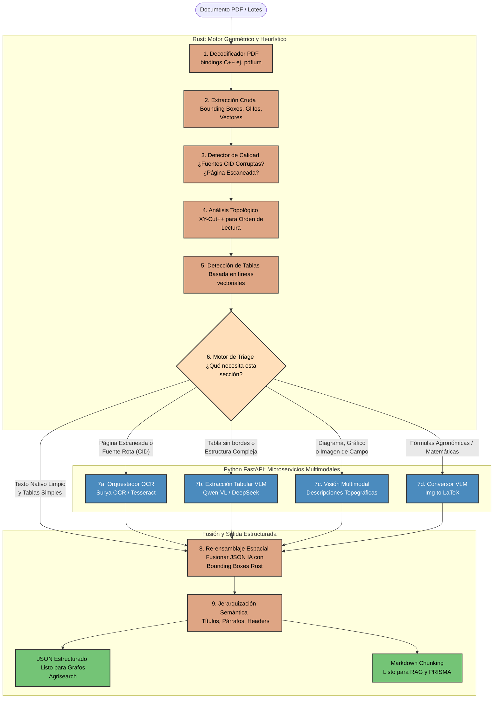
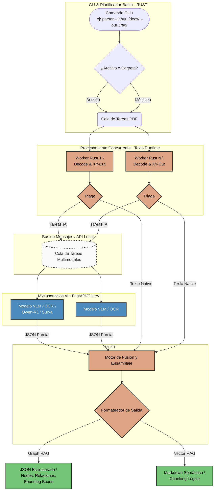

# Documento de Referencia: Arquitectura y Diseño de Strata-Reader

> **Estado:** Histórico — este documento refleja el análisis inicial de migración. La arquitectura implementada está documentada en el `README.md` y los crates Rust del monorepo.

**Proyecto:** `strata-reader`
**Objetivo:** Documentar la arquitectura concurrente, determinista y multimodal basada en Rust (Core) y Python (IA) para extracción documental de PDFs científicos.
**Casos de Uso Principales:** Alimentación de sistemas RAG (Vectorial) y Graph RAG (Grafos de Conocimiento) bajo rigor metodológico (ej. PRISMA 2020). 

---

## 0. Arquitectura Inicial pensada

Pensamiento de flujo de datos del pdf, con salidas del pdf parseado a md o json para arquitecturas RAG.

---

## 1. Arquitectura Objetivo

El sistema se basará en el siguiente flujo de procesamiento asíncrono y distribuido:

---

## 2. Mapa de Extracción de Conocimiento (De OpenDataLoader a Strata-Reader)

Para construir `strata-reader` con Rust y Python, **no haremos una traducción 1:1 del código Java**, sino una reingeniería funcional de sus algoritmos matemáticos y lógicos. A continuación, se detallan los módulos críticos a analizar y portar:

### 2.1. Motor Geométrico y Orden de Lectura (Rust Core)

El valor real del repositorio original reside en sus heurísticas espaciales. Debemos extraer la lógica matemática de los siguientes componentes:

* **El Algoritmo XY-Cut++ (`org.opendataloader.pdf.processors.readingorder.XYCutPlusPlusSorter`):**
* **Concepto a extraer:** Cómo el sistema proyecta "perfiles" horizontales y verticales de los *bounding boxes* para encontrar canales en blanco continuos que dividen columnas y párrafos.
* **Destino:** Reescritura pura en Rust optimizada con estructuras de datos espaciales (ej. R-Trees).

* **Detección de Tablas Basada en Líneas (`org.opendataloader.pdf.processors.TableBorderProcessor` y `ClusterTableProcessor`):**
* **Concepto a extraer:** La lógica de intersección de vectores gráficos (Path/LineArt) para inferir celdas tabulares estándar sin usar IA.

* **Detector de Calidad y Fuentes CID (`org.opendataloader.pdf.processors.CidFontDetectionTest` / Heurísticas de texto):**
* **Concepto a extraer:** Las métricas de evaluación que determinan si una página tiene el texto corrupto (sin diccionarios `ToUnicode`) y requiere ser enviada al OCR por completo.

### 2.2. Lógica del Triage Engine (Rust Core -> Python IA)

OpenDataLoader utiliza un modo "Híbrido" delegando tareas complejas a APIs externas (Docling, Hancom). En `strata-reader`, el Triage enrutará las tareas hacia nuestro microservicio Python local.

* **Reglas de Decisión (`org.opendataloader.pdf.hybrid.TriageProcessor`):**
* **Concepto a extraer:** El árbol de decisión. Cuándo el `TriageProcessor` decide que un bloque es "Seguro" (resolver en Rust) vs "Inseguro/Complejo" (recortar y enviar a IA).
* **Factores a portar:** Densidad de elementos superpuestos, fallas en la extracción léxica, detección de gráficos (`PictureProcessor`) o tablas complejas.

### 2.3. Estructuras de Datos y Ensamblaje (Rust Core)

Para la reconstrucción del documento, necesitamos entender el modelo de datos interno original para replicar las jerarquías semánticas.

* **Jerarquía de Clases (`org.opendataloader.pdf.entities.*`):**
* **Concepto a extraer:** Las interfaces que estructuran el árbol AST del documento: `Document` -> `Page` -> `Chunk` -> `Line` -> `Word`.
* **Destino:** `structs` y `enums` de Rust que soporten serialización mediante `serde`. Es crítico mantener los `BoundingBoxes` `(x0, y0, x1, y1)` en cada nodo para la trazabilidad (PRISMA).

* **Serializadores (`org.opendataloader.pdf.json` y `markdown`):**
* **Concepto a extraer:** Las reglas de indentación semántica (`HeadingProcessor`) para transformar el árbol estructural en Markdown (útil para semantic chunking) o JSON (útil para grafos).

---

## 3. Anti-Patrones: Qué NO extraer de OpenDataLoader

Para asegurar el rendimiento y la escalabilidad de `strata-reader`, las siguientes lógicas del repositorio Java deben ser **descartadas y rediseñadas**:

1. **Dependencias Pesadas de Bajo Nivel:** No intentaremos construir un decodificador de PDF en Rust puro. Usaremos *bindings* seguros sobre motores C++ robustos (como `pdfium-render`).
2. **Llamadas a APIs Externas Cloud:** Descartar toda la lógica de los clientes HTTP (Docling remoto, Hancom). Toda la inferencia semántica (VLMs, OCR) se realizará a nivel local mediante comunicación RPC/HTTP con el microservicio FastAPI en Python.
3. **Procesamiento Lineal / Bloqueante:** El parseo en Java procesa página por página sincrónicamente. El `Rust Core` usará `tokio` para desempaquetar las páginas y procesarlas asincrónicamente.
4. **Mutabilidad Orientada a Objetos:** En lugar de pasar objetos de página que son mutados por múltiples "Procesadores", usaremos un flujo de datos funcional (Pipeline) donde cada estado devuelve una nueva versión inmutable del árbol de datos.

---

## 4. Estado del Proyecto

Todas las fases de implementación descritas en el Plan Maestro (Fases 0-10) están completadas a nivel de código. El pipeline Rust produce Markdown y JSON desde PDFs reales. La capa IA (Python/Ollama) está implementada con contrato gRPC.

### 4.1. Distribución Zero-Friction (Fase 13)
En la Fase 13 se ha logrado la independencia operativa de dependencias externas complejas para el usuario de Python SDK. Mediante un sistema de ruedas de Python (Wheels) autocontenidas creadas en CI (`release-wheels.yml`):
1. **Empaquetado de libpdfium:** Se descargan las versiones precompiladas de `libpdfium` (Chromium Milestone 7843) para Linux (x64/aarch64), macOS (Apple Silicon/Universal) y Windows (x64).
2. **Reparación del Wheel:** Se utilizan herramientas de reparación nativas (`auditwheel` en Linux, `delocate` en macOS y `delvewheel` en Windows) para inyectar y corregir enlaces dinámicos de las bibliotecas compartidas (`.so`, `.dylib`, `.dll`) directamente dentro de la rueda compilada.
3. **Auto-descubrimiento en Runtime:** Al importar `strata_reader`, el cargador detecta automáticamente el directorio `_pdfium` empaquetado, configurando `STRATA_PDFIUM_LIB_PATH` y agregando el directorio al DLL search path en Windows (`os.add_dll_directory`).

Esto permite un flujo de instalación inmediato mediante `pip install strata-reader` libre de dependencias manuales del sistema.
