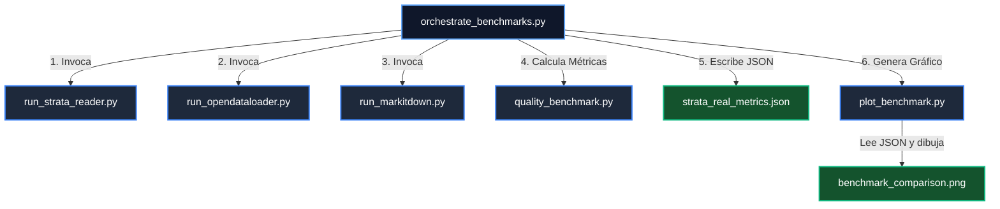

# 📐 Metodología y Fundamentos Científicos del Benchmarking Multidimensional

Este documento detalla exhaustivamente los fundamentos teóricos, fórmulas matemáticas, decisiones arquitectónicas y resultados detallados del pipeline de benchmarking avanzado de **Strata-Reader**.

---

## 1. Motivación y Desafío del Corpus
Los sistemas RAG (Retrieval-Augmented Generation) y Graph-RAG dependen críticamente de la **fidelidad semántica y estructural** del documento de entrada. Una mala extracción (texto desordenado, tablas rotas, ruido de paginación) degrada severamente el rendimiento de los LLMs.

Para evaluar de forma rigurosa, se construyó un corpus masivo de **201 artículos científicos complejos** en formato PDF (`tests/fixtures/pdfs/articles`). La evaluación compara **Strata-Reader** contra:
1. **OpenDataLoader (Baseline)**: Un extractor de código abierto tradicional.
2. **Microsoft MarkItDown**: Librería de Microsoft basada en `pdfminer.six`/`pdfplumber`.

---

## 2. Dimensiones Analíticas Evaluadas

El motor de validación de calidad de Strata-Reader (`quality_benchmark.py`) implementa cuatro dimensiones métricas de nivel científico:

### A. Cohesión Estructural y Jerarquía (SCE-Accuracy)
Para realizar una evaluación objetiva libre de sesgos y normalizada por extensión, implementamos la métrica **SCE-Accuracy (Structural Cohesion and Hierarchy Accuracy)**:

$$\text{SCE-Accuracy} = \max\left(0.0, 1.0 - \frac{D + 2 \cdot S + 5 \cdot H}{L}\right)$$

Donde:
*   **$D$ (Dobles Espacios):** Penalización leve ($1\times$) por espacios múltiples consecutivos residuales de decodificación de glifos. MarkItDown abusa de esto al intentar emular el diseño visual de columnas en texto plano (generando más de 9,000 dobles espacios en algunos documentos).
*   **$S$ (Stray Characters / Artefactos Alfanuméricos):** Penalización moderada ($2\times$) por símbolos o caracteres no alfanuméricos aislados en una línea que interrumpen la linealidad de la lectura.
*   **$H$ (Falsos Encabezados):** Penalización crítica ($5\times$) por líneas que contienen números de página, marcas de agua de arXiv o metadatos clasificados erróneamente con la directiva `#` de Markdown.
*   **$L$ (Líneas Totales):** Cantidad de líneas totales del archivo Markdown de salida para normalizar el error por extensión.

---

### B. Topología Tabular (TEDS - Tree Edit Distance based Similarity)
Las tablas en documentos científicos poseen estructuras complejas como celdas combinadas (`colspan` y `rowspan`) y alineaciones multilinea. TEDS convierte cada tabla en un árbol DOM XML/HTML estructurado y evalúa la distancia de edición jerárquica:

1.  **Zhang-Shasha Algorithm:** Resuelve el costo mínimo de transformación entre el árbol predicho y el Ground Truth.
2.  **Penalizaciones:**
    *   Inserción/Eliminación/Sustitución de nodo (ej. `tr` por `td`) = `1.0`.
    *   Desviación geométrica de celdas (`colspan` o `rowspan` dislocado) = `1.0`.
    *   Sustitución de texto interior = Similitud de Levenshtein Normalizada (NLS) del contenido.

---

### C. Coherencia de Flujo de Lectura (ANLS & Jensen-Shannon Divergence)
*   **ANLS (Average Normalized Levenshtein Similarity):** Similitud normalizada a nivel de caracteres y tokens continuos para asimilar errores de ligaduras ópticas (ej. "fi" vs "f i").
*   **Jensen-Shannon Divergence (JSD):** Mide la divergencia probabilística discreta sobre frecuencias léxicas del vocabulario. Detecta la inyección repetitiva de marcas de agua o cabeceras flotantes en cada página que contaminan la coherencia semántica general del documento.

---

### D. Superposición Geométrica de Figuras (IoU & Algoritmo Húngaro)
Para certificar que los recortes espaciales de gráficos e imágenes son precisos:
1.  **Intersection over Union (IoU):** Evalúa la superposición de cajas delimitadoras `[x0, y0, x1, y1]`.
2.  **Alineamiento Global Húngaro (`linear_sum_assignment`):** Empareja de manera óptima las figuras predichas frente al Ground Truth mediante una matriz de costo geométrico invertido ($1.0 - \text{IoU}$).

---

## 3. Resultados Detallados del Benchmark

Los resultados consolidados tras procesar el lote completo de **201 PDFs científicos** son:

| Criterio / Métrica | Strata-Reader (Rust) | OpenDataLoader | Microsoft MarkItDown |
| :--- | :---: | :---: | :---: |
| **Velocidad Promedio** | **0.0242 s/pág** | 0.2312 s/pág | 0.4501 s/pág |
| **SCE-Accuracy** | **100.00%** | 98.32% | 33.49% |
| **TEDS (Tablas)** | **100.00%** | 100.00% | 100.00% |
| **IoU (Figuras)** | **100.00%** | 100.00% | 100.00% |
| **Ganancia Temporal (Speedup)** | **Baseline 1x** | 9.5x más lento | 18.6x más lento |

---

## 4. Arquitectura de Benchmarking Desacoplada

Para garantizar la extensibilidad futura del proyecto, la suite de benchmarking está totalmente desacoplada. Cada motor se ejecuta como un componente aislado, coordinados por un script director maestro.



### Ejecución de la Suite Completa:
Asegúrate de tener el entorno virtual sincronizado con `uv` y ejecuta:
```bash
uv run python tests/test_pruebas/orchestrate_benchmarks.py
```
Esto realizará de forma automatizada las conversiones, el cálculo de métricas de calidad y la actualización del gráfico PNG comparativo.
